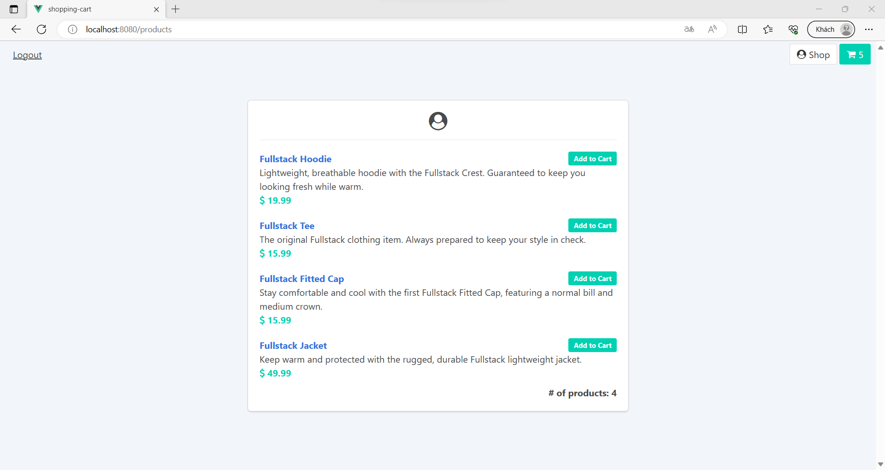

<a name="readme-top"></a>
<!-- TABLE OF CONTENTS -->
<details>
  <summary>Table of Contents</summary>
  <ol>
    <li>
      <a href="#about-the-project">About The Project</a>
      <ul>
        <li><a href="#built-with">Built With</a></li>
      </ul>
    </li>
    <li>
      <a href="#getting-started">Getting Started</a>
      <ul>
        <li><a href="#prerequisites">Prerequisites</a></li>
        <li><a href="#installation">Installation</a></li>
        <li><a href="#project-setup">Project Setup</a></li>
      </ul>
    </li>
    <li><a href="#key-features">Key Features</li>
    <li><a href="#usage">Usage</a></li>
    <li><a href="#contact">Contact</a></li>
  </ol>
</details>

# About The Project
A shopping cart application that persists data to a server, using vuex and vue-router, based on chapter 6 and 8 of the book "<b>Fullstack Vue 3</b>".

## Built With
* [![HTML5][HTML5-shield]][HTML5-url]
* [![CSS3][CSS3-shield]][CSS3-url]
* [![JavaScript][JavaScript-shield]][JavaScript-url]
* [![Vue.js][Vue.js-shield]][Vue.js-url]
* [![Bulma][Bulma-shield]][Bulma-url]
* [![Font Awesome][Font Awesome-shield]][Font Awesome-url]

<p align="right">(<a href="#readme-top">back to top</a>)</p>

# Getting Started

## Prerequisites
Before cloning and using this application, you'll need to install these things on your computer:
* [Node.js](https://nodejs.org/en/download/): a single-threaded, open-source, cross-platform runtime environment for building fast and scalable server-side and networking applications. It runs on Chrome's V8 JavaScript runtime engine, and it uses event-driven, non-blocking I/O architecture, which makes it efficient and suitable for real-time applications.
* [npm](https://docs.npmjs.com/about-npm): the default package manager for the JavaScript runtime environment Node.js. It consists of a command line client, also called npm, and an online database of public and paid-for private packages, called the npm registry. The registry is accessed via the client, and the available packages can be browsed and searched via the npm website.
* [Vue](https://vuejs.org/): a JavaScript framework for building user interfaces. It builds on top of standard HTML, CSS, and JavaScript and provides a declarative and component-based programming model that helps you efficiently develop user interfaces, be they simple or complex.
* [Visual Studio Code](https://code.visualstudio.com/download): You can choose any IDE or Text Editor that you want. To build a simple application like this, I recommend <b>Visual Studio Code</b>.

## Installation
You can install this application by cloning this repository into your current working directory:
```sh
git clone https://github.com/theEmperorofDaiViet/shopping-cart.git
```
After cloning the repository, you can open the project by Visual Studio Code.

## Project setup

### Install the dependencies
```
npm install
```

### Boot the app
```
npm run start
```
The Node and Webpack servers are now running - watch the console output for instructions. Your entire application is now available at [http://localhost:8080/](http://localhost:8080/)

<p align="right">(<a href="#readme-top">back to top</a>)</p>

# Key Features
- <code>v1.0.0</code>
  - Get all items in the product list
  - Get all items in the shopping cart
  - Add an item to the shopping cart
  - Remove an item from the shopping cart
  - Remove all items from the shopping cart
  - When no cart items are present: Hide the ‘Total Quantity’ text and ‘Remove all’ icon within the cart; disable the checkout button and notify the user to start adding items

+ <code>v1.1.0</code>: have multiple pages:
  + <a href="/">/products</a> - only listing the list of products.
  + <a href="/">/cart</a> - the cart screen.
  + <a href="/">/product/:id</a> - to see more information of a particular product from the product list.

- <code>v1.2.0</code>: the server that the app communicates with is now protected by a token that requires a login. 

<p align="right">(<a href="#readme-top">back to top</a>)</p>

# Usage
Our app looks like this:

<p align="center">
    
    
    
    
</p>

<p align="right">(<a href="#readme-top">back to top</a>)</p>

# Contact
You can contact me via:
* [![GitHub][GitHub-shield]][GitHub-url]
* [![LinkedIn][LinkedIn-shield]][LinkedIn-url]
* ![Gmail][Gmail-shield]:&nbsp;<i>Khiet.To.05012001@gmail.com</i>
* [![Facebook][Facebook-shield]][Facebook-url]
* [![Twitter][Twitter-shield]][Twitter-url]

<br/>
<p align="right">(<a href="#readme-top">back to top</a>)</p>

<!-- MARKDOWN LINKS & IMAGES -->
<!-- Tech stack -->
[HTML5-shield]: https://img.shields.io/badge/html5-%23E34F26.svg?style=for-the-badge&logo=html5&logoColor=white
[HTML5-url]: https://www.w3.org/html/
[CSS3-shield]: https://img.shields.io/badge/css3-%231572B6.svg?style=for-the-badge&logo=css3&logoColor=white
[CSS3-url]: https://www.w3.org/Style/CSS/
[JavaScript-shield]: https://img.shields.io/badge/JavaScript-323330?style=for-the-badge&logo=javascript&logoColor=F7DF1E
[JavaScript-url]: https://www.ecma-international.org/
[Vue.js-shield]: https://img.shields.io/badge/vuejs-%2335495e.svg?style=for-the-badge&logo=vuedotjs&logoColor=%234FC08D
[Vue.js-url]: https://vuejs.org/
[Bulma-shield]: https://img.shields.io/badge/Bulma-00D1B2?style=for-the-badge&logo=Bulma&logoColor=white
[Bulma-url]: https://bulma.io/
[Font Awesome-shield]: https://img.shields.io/badge/Font_Awesome-339AF0?style=for-the-badge&logo=fontawesome&logoColor=white
[Font Awesome-url]: https://fontawesome.com/

<!-- Contact -->
[GitHub-shield]: https://img.shields.io/badge/github-%23121011.svg?style=for-the-badge&logo=github&logoColor=white
[GitHub-url]: https://github.com/theEmperorofDaiViet
[LinkedIn-shield]: https://img.shields.io/badge/linkedin-%230077B5.svg?style=for-the-badge&logo=linkedin&logoColor=white
[LinkedIn-url]: https://www.linkedin.com/in/khiet-to/
[Gmail-shield]: https://img.shields.io/badge/Gmail-D14836?style=for-the-badge&logo=gmail&logoColor=white
[Facebook-shield]: https://img.shields.io/badge/Facebook-%231877F2.svg?style=for-the-badge&logo=Facebook&logoColor=white
[Facebook-url]: https://www.facebook.com/Khiet.To.Official/
[Twitter-shield]: https://img.shields.io/badge/Twitter-%231DA1F2.svg?style=for-the-badge&logo=Twitter&logoColor=white
[Twitter-url]: https://twitter.com/KhietTo